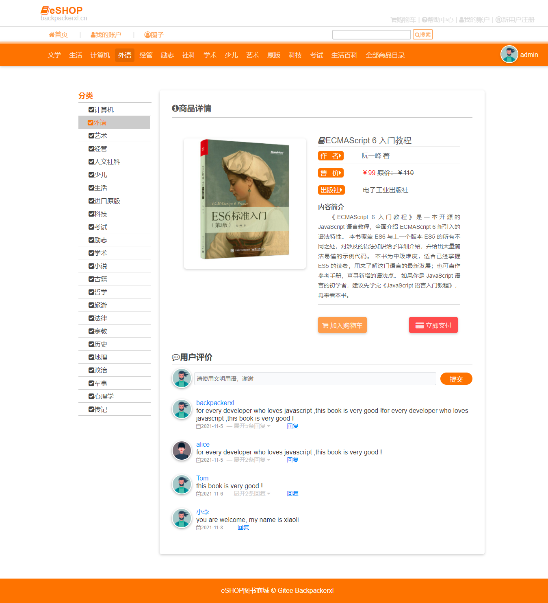
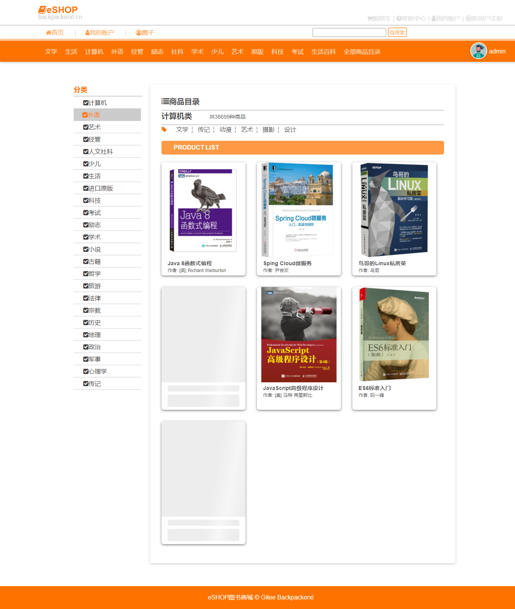

### book-store project
> Here, This is a Book Mall project, which is developed by JavaWeb. 
> It is suitable for friends who have just learned JavaWeb.
> At present, only the foreground code and background code may be added later.
> Welcome to participate in joint development.

### The following is the rendering display
- index page

- info page

- shop page

- car page

